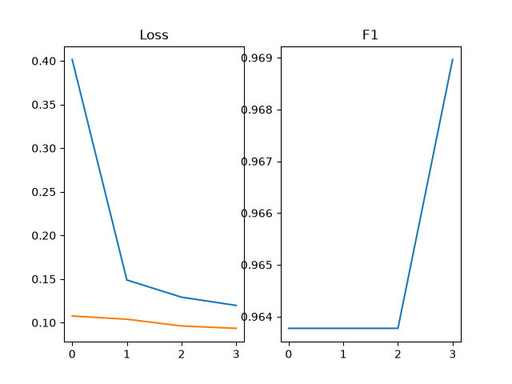
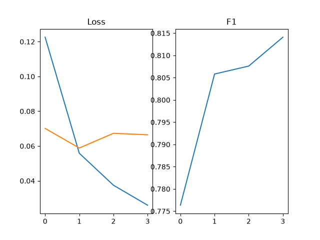
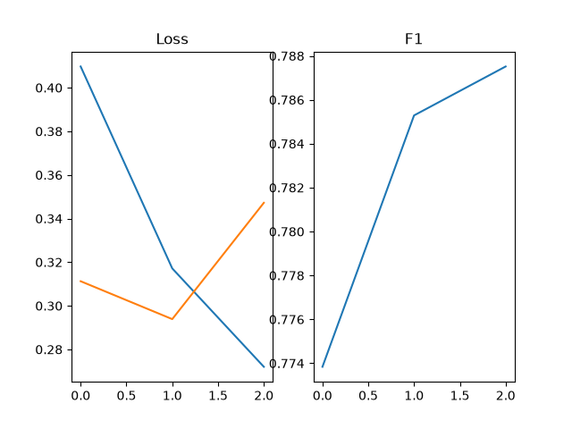

# Transformer-Based NLP Systems for Anaphora Resolution, Named Entity Recognition and Sentiment Classification

## Overview

This project explores the application of transformer-based models across three different Natural Language Processing (NLP) tasks:

- Anaphora Resolution
- Named Entity Recognition
- Sentiment Classification

The aim of this project was to understand the challenges involved in building transformer-based NLP systems, including data preprocessing, class imbalance, token-level annotation alignment, and evaluation strategy.


Each task highlights a different aspect of building effective AI systems:

Task| Main Focus
|---|---|
Anaphora Resolution| Designing a custom preprocessing pipeline to transform coreference data into a classification problem
Named Entity Recognition| Token-level classification
Sentiment Analysis| Handling class imbalance and optimising decision thresholds


---

# Anaphora Resolution

## Overview

The anaphora resolution task required the largest custom preprocessing pipeline.

The original dataset contains document-level coreference chains, which were transformed into a multiple-choice classification problem suitable for SpanBERT. The model is presented with three spans, one for each noun candidate, in the tokenised format format:
```python
span, f"{pronoun} refers to {nounCandidate}"
```

The model learns to select which candidate antecedent a pronoun refers to.

## Custom Data Pipeline

The preprocessing pipeline:

1. Extracts valid noun-pronoun relationships from coreference chains.
2. Converts sentence-based document representation into a flattened token sequence and adjusts mentions indices to match.
3. Generates two distractor noun candidates while avoiding nouns also appearing in the gold coreference chains.
4. Extracts a local context span around the candidate mentions.
5. Removes ambiguous examples.
6. Randomises candidate ordering to prevent positional label bias.
7. Converts each example into SpanBERT multiple-choice inputs.

## Key Contribution

The main contribution of this task is the data engineering pipeline.

Rather than using the dataset directly, the coreference annotations were redesigned into a supervised classification format, allowing a transformer classifier to be trained on the problem.

## Results
This task achieved a test F1 score of 0.98 and accuracy of 0.98. In training the model achieved a validation F1 of 0.97, see the graph below for training, validation loss graph and validation F1 graph. The results being this high are likely down to how pure the data is; where I could see obvious ambiguity I choose to disregard the noun-pronoun sample. It would be interesting to see how the model performs on a more difficult anaphora task.


---


# Named Entity Recognition

## Overview

The NER model performs token-level entity classification using BERT based token classification.

NER requires predictions for individual tokens while maintaining alignment between the original word-level annotations and the model's subword tokenisation.

## Key Contributions

### Token-Level Label Alignment

A custom preprocessing pipeline was implemented to align dataset annotations with transformer-generated subword tokens.

Special tokens and continuation subwords are ignored during loss calculation using the "-100" masking strategy.

### Evaluation

The evaluator applies masking before calculating macro F1, ensuring that non-entity padding tokens do not influence performance.

## Results
This task achieved a test F1 score of 0.79. In training the model achieved a validation F1 of 0.81 and did slightly increase in later epochs however, the validation loss had already begun to climb so early stopping is preferable. See the graph below for training, validation loss graph and validation F1 graph.

For 36 class NER a macro F1 of 0.79 is a solid result, but it had a 0.98 weighted F1 suggesting it performs significantly better on the common entities
When we look at the full class F1 we can see this is the case. Here we can see many scores higher than 0.90 but also some below 0.70. The lowest is 0 for I-LANGUAGE and I-ORDINAL. This is likely because there isn't much meaning in the subsequent tokens of language and ordinals, combined with the low frequency in the dataset.

``` text
I-DATE -- 0.8888        B-DATE -- 0.8790
I-EVENT -- 0.7146        B-EVENT -- 0.6847
I-FAC -- 0.6741        B-FAC -- 0.6360
I-GPE -- 0.9122        B-GPE -- 0.9384
I-LANGUAGE -- 0.0000        B-LANGUAGE -- 0.8571
I-LAW -- 0.8333        B-LAW -- 0.8837
I-LOC -- 0.7680        B-LOC -- 0.7728
I-MONEY -- 0.9535        B-MONEY -- 0.9157
I-NORP -- 0.7702        B-NORP -- 0.9184
I-ORDINAL -- 0.0000        B-ORDINAL -- 0.8344
I-ORG -- 0.9243        B-ORG -- 0.9186
I-PERCENT -- 0.9622        B-PERCENT -- 0.9520
I-PERSON -- 0.9547        B-PERSON -- 0.9466
I-PRODUCT -- 0.7364        B-PRODUCT -- 0.6860
I-QUANTITY -- 0.8516        B-QUANTITY -- 0.7174
I-TIME -- 0.7455        B-TIME -- 0.7064s
I-WORK_OF_ART -- 0.7673        B-WORK_OF_ART -- 0.7129
I-CARDINAL -- 0.8128        B-CARDINAL -- 0.8489
O -- 0.9925
```


---


# Sentiment Classification

## Overview

The sentiment model performs offensive language classification on tweets using a transformer-based classifier.

The primary engineering challenge addressed in this task was class imbalance. Offensive examples represent a smaller proportion of the dataset, meaning a standard classifier can become biased towards the majority class.

## Key Contributions

### Class Imbalance Handling

A weighted loss was implemented to increase the contribution of minority-class errors during training.

A larger loss weight was given to offensive class attempts to reduce false negatives. This reflects the intended design of an offensive language filter and I was working under the assumption that marking some non-offensive tweets is perfered compared wiht not flagging offensive tweets.

### Threshold Optimisation

Instead of relying on the default 0.5 classification threshold, the validation evaluator searches across multiple thresholds.

The threshold producing the highest validation macro F1 score is stored and reused during inference.

This allows the model's decision boundary to be adapted to the characteristics of an imbalanced dataset.

## Results
This task achieved a test F1 score of 0.80. In training the model achieved a validation F1 of 0.79. The validation loss did increase on the last epoch but the F1 did not drop.
The F1 was chosen for stopping as the validation loss increase was small and training is only three epochs, which could explain noise.
See the graph below for training, validation loss graph and validation F1 graph.

The macro F1 of 0.80 despite classes imbalances is a good result but if we look at the classes and confusion matrix:

Non-Offensive F1 | Offensive F1
|---|---|
0.89| 0.72

ConMat |\ | Positive | Negative
|---|---|---|---|
Positive |\ | 552 | 68
Negative |\ | 68 | 172

The confusion matrix shows non-offensive is still favoured in classification, although the imbalance has been reduced through the weighted training and threshold optimisation. An interesting result is that both false negatives and false positives are the same count of 68.



---

# Common Training Framework

All three tasks share the same reusable training framework, allowing task-specific logic to be separated from the optimisation pipline.


Shared features include:

- reusable training, validation, and testing loops
- task-specific evaluators
- experiment logging
- model checkpoint saving
- metric tracking

The evaluation framework separates model training from task-specific metric calculation, allowing different NLP problems to share the same training workflow.

---

# Project Structure

```text
project/
│
├── experiments/
├── src/
    ├── anaphora/
          ├── data.py
          ├── preprocess.py
          └── evaluator.py
    ├── ner/
          ├── data.py
          └── evaluator.py
    ├── sentiment/
        ├── data.py
        └── evaluator.py
    └── common/
        ├── logger.py
        ├── testLoop.py
        └── trainLoop.py
    └── main.py
```
---

# Running

Run the project from the src directory using: `main.py <task> <mode>`

Tasks:
- Anaphora
- Ner
- Sentiment

Modes:
- Train
- Test

Example:
```bash
main.py ner test
```
```bash
main.py sentiment train
```

The experiments file contains pre-trained model weights of the best model found. If the project is run in training mode these will be overwritten.

## Requirements
The system relies on the spacy `en_core_web_sm` model for the anaphora data pipeline as well as python libraries.

The `setup.sh` file runs `loadModelWeights` which pulls the best model weights from the Hugging Face repo.

Execute:
```bash
./setup.sh
```


---

# Technologies Used

- Python
- PyTorch
- Hugging Face Transformers
- Hugging Face Datasets
- spaCy
- scikit-learn

### pre-trained models:
- SpanBERT base
- BERT based cased token classification
- BERT based uncased 

---
# Skills Demonstrated

- Transformer fine tuning
- Custom NLP preprocessing pipelines
- Hugging Face Datasets and Transformers
- PyTorch training loops
- Token classification
- Token-level annotation alignment
- Multiple-choice transformer models
- Handling class imbalance
- Threshold optimisation
- Model evaluation using Macro F1
- Experiment tracking

---

